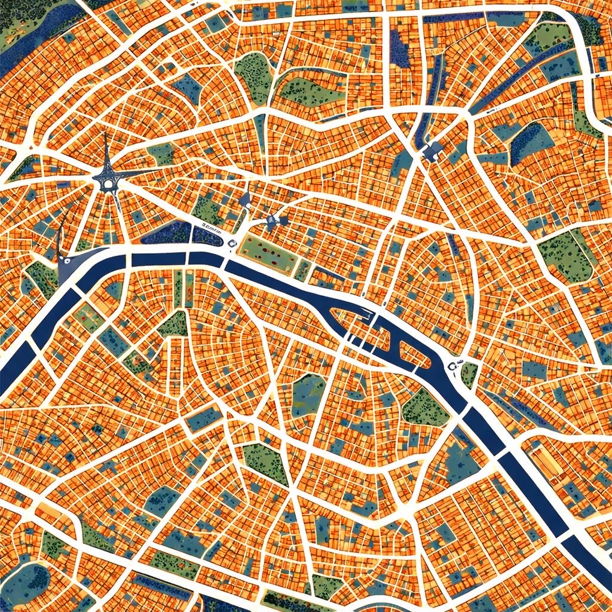
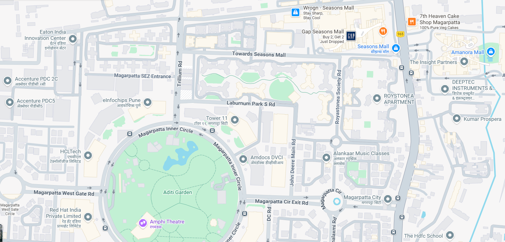

# Deep Reinforcement Learning for Autonomous Urban Navigation

This project implements an **autonomous vehicle navigation system** using **Deep Q‑Learning (DQN)** with **Prioritized Experience Replay**. The system trains an agent to navigate through a complex urban environment, avoid obstacles, and reach multiple goals in sequence using only sensor-based perception and relative target information.

The focus of the project is to demonstrate how reinforcement learning can be applied to **realistic, irregular city layouts**, where explicit rules are insufficient and adaptive decision‑making is required.

---

## Problem Overview

Urban navigation presents a challenging control problem due to:

* Dense obstacles and narrow roads
* Frequent turns and irregular intersections
* Partial observability from limited sensors
* The need to balance safety, efficiency, and goal completion

Rather than relying on predefined routes or heuristics, the agent learns navigation behavior **entirely from interaction with the environment**, improving through trial and error.

---

## Reinforcement Learning Approach

The system follows a standard reinforcement learning loop:

1. The agent observes its current state from sensors and target-relative features
2. An action is selected from a discrete steering set
3. The environment provides a reward signal
4. The agent transitions to a new state and stores the experience

Over time, the agent learns a policy that maximizes cumulative reward, resulting in increasingly stable and efficient navigation.

---

## Why Deep Q‑Learning?

The navigation task involves a **continuous spatial domain** with non-linear dynamics. Traditional tabular Q‑learning is impractical in such settings.

A **Deep Q‑Network (DQN)** is used to approximate the action‑value function:

```
Q(s, a) ≈ Qθ(s, a)
```

By learning this approximation, the agent can evaluate the long‑term utility of actions directly from sensor readings, enabling generalization across unseen states.

---

## Agent and Environment Interaction

The agent represents a vehicle operating within a 2D city map. At each time step, it receives:

* Distance measurements from multiple forward-facing sensors
* The relative angle to the active navigation target
* The normalized distance to that target

Using this information, the agent must steer safely while continuously progressing toward its objective.

---

## Neural Network Architecture

The DQN is implemented as a fully connected neural network designed to balance expressiveness and computational efficiency.

```
Input Layer (9 features)
        ↓
Fully Connected (128) + ReLU
        ↓
Fully Connected (256) + ReLU
        ↓
Fully Connected (256) + ReLU
        ↓
Fully Connected (128) + ReLU
        ↓
Output Layer (5 actions)
```

This architecture allows the network to capture complex spatial relationships without overfitting to specific trajectories.

---

## State Representation

The state vector consists of nine dimensions:

* Seven distance sensors spanning −45° to +45°
* Normalized angular offset to the current target
* Normalized distance to the current target

This compact representation provides sufficient environmental awareness while keeping learning tractable.

---

## Action Space

The agent operates with a discrete steering action set:

| Action | Description      |
| -----: | ---------------- |
|      0 | Small left turn  |
|      1 | Move straight    |
|      2 | Small right turn |
|      3 | Sharp left turn  |
|      4 | Sharp right turn |

This design enables precise maneuvering in constrained urban spaces.

---

## Experience Replay Strategy

To stabilize learning, experiences are stored and replayed during training rather than being learned from immediately.

The system employs **prioritized experience replay**, increasing the likelihood of sampling transitions that led to successful navigation outcomes. This accelerates convergence while maintaining sufficient exploration of less frequent scenarios.

---

## Training Configuration

Key training characteristics include:

* Gradual reduction of exploration through epsilon decay
* Discounting of future rewards to favor near-term safety
* Soft updates of a target network for stability

All parameters are chosen to encourage smooth learning in complex environments without excessive tuning.

---

## 🗺 Urban City Map Design

The navigation environment is evaluated across two distinct urban layouts, each designed to test the agent’s ability to adapt to different city structures while using the same learning logic and sensor configuration.

Both maps share identical semantics and reward rules, allowing performance differences to emerge purely from spatial complexity and layout geometry.

### Paris Map



This map reflects a more structured European city layout, characterized by:

* Wider roads and smoother curves
* Relatively uniform city blocks
* Open intersections and long sight lines

It encourages stable lane-following behavior and longer forward trajectories.

### Pune Map



This map captures the complexity of a dense Indian urban environment, featuring:

* Narrow roads and sharp turns
* Irregular intersections and asymmetric layouts
* Tightly packed buildings mixed with open grounds

It forces the agent to rely heavily on reactive steering, short-horizon decisions, and precise obstacle avoidance.

Why Multiple Maps?

Using two structurally different city environments allows the project to demonstrate that:

* The learned policy is not tied to a single map
* Navigation behavior emerges from perception and reward feedback
* The same agent can adapt to varying urban geometries without redesigning the algorithm

### Visual Semantics

| Map Element      | Meaning                 |
| ---------------- | ----------------------- |
| Light areas      | Drivable roads          |
| Dark regions     | Buildings and obstacles |
| Green zones      | Open spaces             |
| Restricted areas | Non‑navigable           |

> A map visualization can be included here to illustrate the environment structure.

---

## Sequential Target Navigation

The task is structured around multiple goals:

* Only one target is active at a time
* Reaching a target activates the next
* Each successful reach yields a strong positive reward

This setup encourages long‑horizon planning rather than short‑term movement optimization.

---

## Reward Design

The reward function encodes intuitive navigation behavior:

| Event                   | Reward |
| ----------------------- | -----: |
| Target reached          |   +100 |
| Collision               |   −100 |
| Forward progress        |    +20 |
| Moving away from target |    −10 |
| Time penalty            |   −0.1 |

Rather than enforcing strict rules, the reward structure provides high‑level guidance that allows strategies to emerge naturally.

---

## Running the Project

```bash
python citymap.py
```

---

## Usage Flow

1. Launch the application
2. Place the vehicle start position
3. Define navigation targets on the map
4. Confirm the setup
5. Start training and observe agent behavior

---

## Project Significance

This project demonstrates:

* Practical application of deep reinforcement learning to navigation
* Robust behavior emerging from simple sensor inputs
* Clear separation between learning logic and environment design

It serves as a strong foundation for experimentation, research, and further extensions in autonomous navigation.

---

## Possible Extensions

* Integration of real-world map data
* Traffic rules and dynamic obstacles
* Continuous action control methods
* Multi‑agent navigation scenarios
